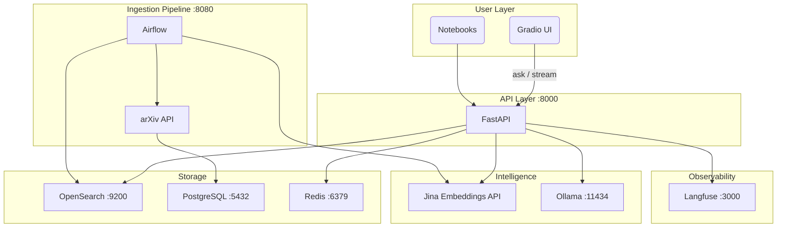
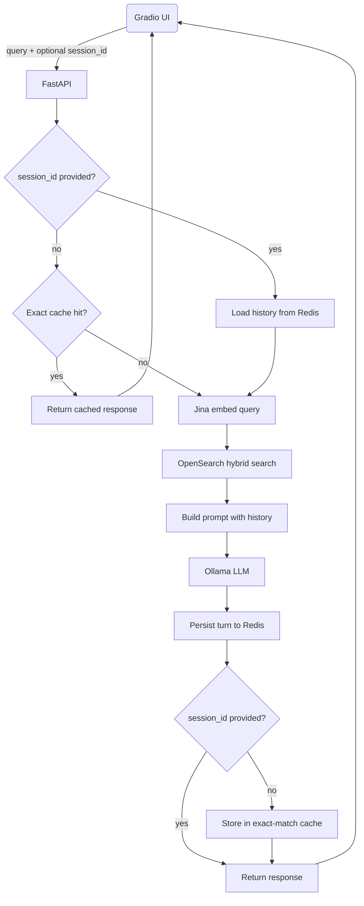
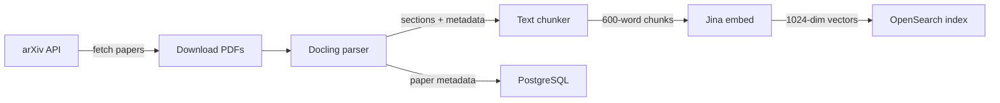

# arXiv RAG: Research Paper Q&A with Multi-Turn Dialogue

A RAG system that pulls in arXiv CS papers every day and lets you ask questions about them through a chat interface. All LLM inference runs locally, so no OpenAI key is needed.

---

## The Problem

ML research moves faster than anyone can keep up with. Hundreds of papers drop on arXiv every week in cs.AI and cs.LG alone. Skimming abstracts only gets you so far. What you really want is to ask questions like *"how do the attention mechanisms in these papers differ?"* and have the system do the reading for you, while remembering what you already asked.

This project does that:

- **Automatic ingestion** of new arXiv papers every weekday morning (Airflow DAG)
- **PDF parsing** that respects document structure instead of splitting on arbitrary character windows (Docling)
- **Hybrid search** that combines keyword and vector retrieval for better results (OpenSearch)
- **Local LLM answers** grounded in the retrieved paper excerpts (Ollama)
- **Conversation memory** so follow-up questions work naturally within a session (Redis)
- **Streaming responses** token-by-token to a chat UI (Gradio + SSE)
- **Full request tracing** for debugging and performance analysis (Langfuse)

---

## By the Numbers

| Metric | Value |
|---|---|
| Query embedding latency | ~370ms (Jina API round-trip) |
| Hybrid search latency | ~72ms (BM25 + k-NN via OpenSearch RRF) |
| Prompt construction | <1ms |
| LLM generation (Llama 1B, CPU-only) | ~51s |
| Cached response latency | ~390ms (145x faster than full LLM call) |
| Cache TTL | 6 hours exact-match, 24 hours session history |
| Chunk size | 600 words with 100-word overlap |
| Embedding dimensions | 1024 (jina-embeddings-v3) |
| Docker services | 10 (single `make start`) |
| Python source files | 65 files, ~5,600 lines |
| Test suite | 51 unit tests |

Latency numbers are from Langfuse traces on a CPU-only machine. The LLM is the bottleneck by a large margin -- retrieval + embedding takes under 500ms combined. Switching to a GPU or a hosted model brings generation under 2s.

---

## Architecture

### System Overview



### Request Flow



### Ingestion Pipeline



---

## Technical Decisions and Trade-offs

### 1. Local LLM via Ollama

**Decision:** Run `llama3.2:1b` locally rather than calling OpenAI or Anthropic.

**Why:** No API cost, no data leaving the machine, no rate limits. For a research Q&A tool where prompts are long and answers take time, per-token billing adds up fast.

**Trade-off:** A 1B parameter model is noticeably weaker than GPT-4 or Claude. It tends to paraphrase retrieved text rather than synthesise across it. You can switch to a larger model (`llama3.2:3b`, `llama3.1:8b`, `qwen2.5:7b`) from the UI dropdown, but those need more RAM and are slower.

---

### 2. Jina AI for Embeddings

**Decision:** Use the Jina AI embeddings API (`jina-embeddings-v3`, 1024 dimensions) rather than a local embedding model.

**Why:** Jina's search-specific task modes (`retrieval.passage` and `retrieval.query`) outperform general sentence transformers on retrieval benchmarks. Running a good embedding model locally needs a GPU or very slow CPU inference. Jina's free tier covers normal usage.

**Trade-off:** This adds an external API dependency. If Jina is unreachable, the code falls back to BM25-only search automatically. Quality drops but the system keeps working.

---

### 3. OpenSearch as the Unified Search Backend

**Decision:** Use one OpenSearch index for both BM25 keyword search and k-NN vector search, rather than running a dedicated vector database alongside a separate full-text engine.

**Why:** Fewer services to run and keep in sync. OpenSearch's k-NN plugin (HNSW via nmslib) handles 1024-dim vectors fine at this scale, and its BM25 engine is solid.

**Trade-off:** OpenSearch is heavier than a purpose-built vector DB and needs around 2 GB of RAM. Purpose-built vector databases can squeeze out better ANN performance at scale, but the paper corpus here is small enough that it does not matter.

---

### 4. Hybrid Search with Reciprocal Rank Fusion

**Decision:** Combine BM25 and vector search results using OpenSearch's RRF pipeline rather than a weighted linear combination.

**Why:** RRF handles the score-scale mismatch between BM25 and cosine similarity without manual weight tuning. It consistently beats naive weighted fusion across different domains.

**Trade-off:** RRF adds a small latency overhead (an extra pipeline stage inside OpenSearch). A linear combination is faster but fragile because BM25 scores and cosine similarities live on completely different scales and need careful normalisation to blend sensibly.

---

### 5. Section-Based Chunking

**Decision:** Use Docling to extract the section structure from PDFs, then chunk at section boundaries with a 600-word target and 100-word overlap.

**Why:** Splitting on arbitrary character counts cuts across paragraphs and section boundaries, which hurts retrieval quality. Keeping related content together means retrieved chunks actually make sense in isolation.

**Trade-off:** Docling is a heavy dependency (about 1 GB installed) and parses PDFs much more slowly than a simple extractor like `pdfplumber`. For a nightly batch pipeline this is fine. For real-time ingestion it would not be.

---

### 6. Redis for Both Caching and Session State

**Decision:** Use Redis for exact-match query caching (6 hour TTL) and multi-turn session history (24 hour rolling TTL), rather than separate dedicated systems.

**Why:** Redis handles both jobs well with native TTL support and LRU eviction. One shared instance means one fewer service to operate.

**Trade-off:** Both caches share a 256 MB memory budget. Under heavy session load, LRU eviction could start dropping exact-match cache entries. For a small number of concurrent users this is not a real concern.

Cache keys are SHA-256 hashes of the full request parameters (query, model, top_k, use_hybrid, categories). Session requests bypass the exact-match cache entirely since history is injected into the prompt instead.

---

### 7. Stateless-First Session Design

**Decision:** Requests without a `session_id` are fully stateless and cache-eligible. Sessions are opt-in: the client passes back the `session_id` from the first response to continue a conversation.

**Why:** Single questions stay fast and cache-friendly. Sessions are only as expensive as they need to be.

**Trade-off:** The Gradio UI is responsible for holding and sending the `session_id`. If the page is refreshed or the ID is lost, there is no way to reconnect to the old conversation since there is no authentication layer. Session history is also capped at the last 10 messages (5 turns) to keep prompt sizes manageable for small local models.

---

### 8. Airflow for Ingestion Orchestration

**Decision:** Schedule the daily ingestion pipeline with Apache Airflow rather than a cron job.

**Why:** Airflow gives you retry logic, task-level failure isolation, a UI to inspect past runs, and a DAG definition that makes the pipeline dependencies explicit.

**Trade-off:** Airflow is heavy for what is essentially five sequential tasks running once a day. A cron job calling a Python script would be much simpler. It is used here because it reflects how production data pipelines are actually built.

---

### 9. Langfuse for Observability

**Decision:** Wrap every RAG request in a Langfuse trace that records embeddings, search, prompt construction, and generation as child spans.

**Why:** RAG pipelines break in subtle ways. Tracing makes it easy to tell whether a bad answer came from retrieval, the prompt, or the model. Langfuse is self-hosted so traces stay on your machine.

**Trade-off:** Langfuse needs three extra containers (Langfuse server, PostgreSQL, and ClickHouse). If you do not want tracing, set `LANGFUSE__ENABLED=false` and every tracing call becomes a no-op.

---

## Running Locally

### Prerequisites

| Requirement | Version | Notes |
|---|---|---|
| Docker + Docker Compose | 24+ | All services run in containers |
| Python | 3.12+ | For notebooks and the Gradio UI |
| [uv](https://docs.astral.sh/uv/) | latest | Fast Python package manager |
| [Jina API key](https://jina.ai/) | free tier | Only external key you need |
| RAM | 8 GB minimum | 16 GB recommended for larger models |
| Disk | ~15 GB | Models, PDFs, OpenSearch data |

### 1. Clone and install

```bash
git clone https://github.com/aksh-ay06/RAG.git
cd RAG
uv sync
```

### 2. Configure environment

```bash
cp .env .env.local   # use as a template, or edit .env directly
```

The only values you need to set:

```bash
# Required: Jina AI embedding API key (free at https://jina.ai/)
JINA_API_KEY=jina_...

# Optional: Langfuse tracing (disable if you do not want it)
LANGFUSE__ENABLED=false        # set true and fill keys to enable
LANGFUSE__PUBLIC_KEY=pk-lf-...
LANGFUSE__SECRET_KEY=sk-lf-...
```

Everything else defaults to localhost ports that match the Docker Compose config.

### 3. Start all services

```bash
make start
```

This builds the FastAPI container and pulls images for OpenSearch, Ollama, Redis, PostgreSQL, Airflow, and Langfuse. The first run takes a few minutes.

```bash
make health
# or check individual containers:
docker compose ps
```

### 4. Pull the LLM model

```bash
docker exec rag-ollama ollama pull llama3.2:1b
```

Larger optional models (need more RAM):
```bash
docker exec rag-ollama ollama pull llama3.2:3b
docker exec rag-ollama ollama pull llama3.1:8b
```

### 5. Ingest papers

**Option A: Trigger the Airflow DAG (recommended)**

1. Open Airflow at http://localhost:8080 (login: `admin` / `admin`)
2. Enable and trigger the `arxiv_paper_ingestion` DAG
3. Watch it fetch papers, parse PDFs, embed chunks, and index to OpenSearch

**Option B: Work through the notebooks**

```bash
uv run jupyter lab notebooks/
```

| Module | What it covers |
|---|---|
| 1 | Verify all services are running |
| 2 | Fetch arXiv papers, parse PDFs, store in PostgreSQL |
| 3 | Build the OpenSearch index, run BM25 queries |
| 4 | Add vector embeddings, compare retrieval modes |
| 5 | Connect search to Ollama for end-to-end Q&A |
| 6 | Exact-match cache and session state in Redis |
| 7 | Conversation history and multi-turn sessions |

### 6. Start the chat UI

```bash
uv run python gradio_launcher.py
```

Open http://localhost:7861 and start asking questions.

---

## Service URLs

| Service | URL | Credentials |
|---|---|---|
| Chat UI (Gradio) | http://localhost:7861 | none |
| API | http://localhost:8000 | none |
| API docs (Swagger) | http://localhost:8000/docs | none |
| Airflow | http://localhost:8080 | admin / admin |
| OpenSearch Dashboards | http://localhost:5601 | admin / admin |
| Langfuse | http://localhost:3000 | set on first run |
| Ollama | http://localhost:11434 | none |

---

## Makefile Reference

```bash
make start      # Build and start all containers
make stop       # Stop all containers
make restart    # Restart all containers
make status     # Show container status
make logs       # Stream all container logs
make health     # Check API, OpenSearch, Airflow, Ollama

make setup      # Install Python dependencies (uv sync)
make format     # Format code with ruff
make lint       # Lint + type check (ruff + mypy)
make test       # Run pytest suite
make test-cov   # Run tests with HTML coverage report

make clean      # Stop containers and delete all volumes
```
