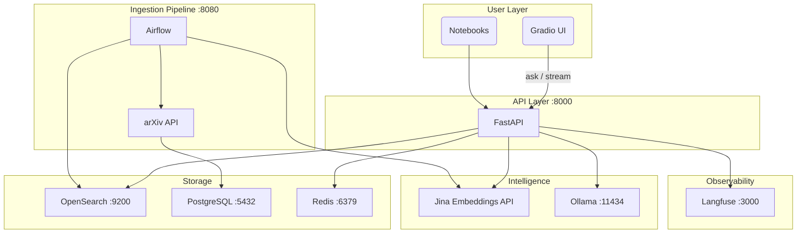
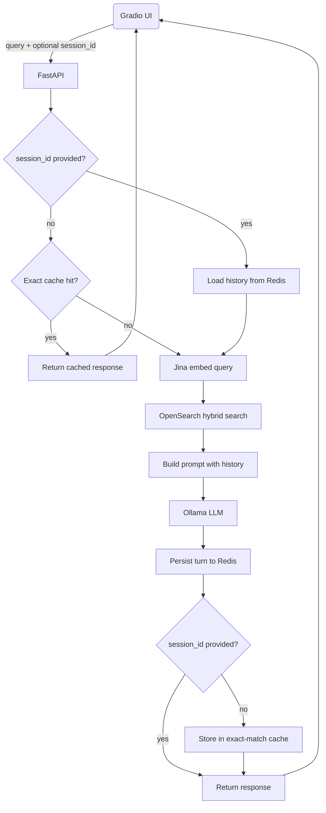
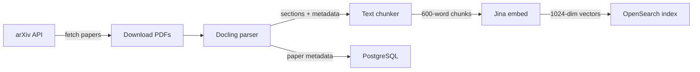

# arXiv RAG — Research Paper Q&A with Multi-Turn Dialogue

A production-grade Retrieval-Augmented Generation system that ingests arXiv CS papers daily and lets you ask questions about them in a conversational chat interface. All LLM inference runs locally — no OpenAI API key required.

---

## The Problem

Machine learning research moves faster than anyone can read. Hundreds of new papers appear on arXiv every week in cs.AI and cs.LG alone. Skimming abstracts is not enough — you need to ask cross-paper questions like *"how do the attention mechanisms in these three papers differ?"* or build on a previous question without repeating context every time.

This system solves that by:

- **Automatically ingesting** new arXiv papers every weekday morning (Airflow DAG)
- **Parsing PDFs** into semantically meaningful sections rather than arbitrary character windows (Docling)
- **Indexing chunks** with both keyword and vector representations for hybrid retrieval (OpenSearch)
- **Answering questions** grounded in retrieved paper excerpts using a local LLM (Ollama)
- **Maintaining conversation context** across follow-up questions within a session (Redis)
- **Streaming answers** token-by-token to a chat UI (Gradio + SSE)
- **Tracing every request** through the pipeline for debugging and performance analysis (Langfuse)

---

## Architecture

### System Overview



### Request Flow



### Ingestion Pipeline



---

## Technical Decisions and Trade-offs

### 1. Local LLM via Ollama

**Decision:** Run `llama3.2:1b` locally instead of calling OpenAI or Anthropic.

**Why:** Zero API cost, no data leaving the machine, no rate limits, and full control over the model. For a research paper Q&A tool where queries can be long and answers take time, per-token billing adds up quickly.

**Trade-off:** A 1B parameter model produces noticeably weaker answers than GPT-4 or Claude — less synthesis, more parroting of retrieved text. The system supports larger Ollama models (`llama3.2:3b`, `llama3.1:8b`, `qwen2.5:7b`) via a dropdown in the UI, but they require more RAM and are slower.

---

### 2. Jina AI for Embeddings

**Decision:** Use the Jina AI embeddings API (`jina-embeddings-v3`, 1024 dimensions) rather than a local embedding model.

**Why:** Jina's search-specific models (`retrieval.passage` and `retrieval.query` tasks) outperform general-purpose sentence transformers on retrieval benchmarks. Running a quality embedding model locally would require a GPU or tolerate slow CPU inference; Jina's free tier covers typical use.

**Trade-off:** The system takes an external API dependency for embedding. If Jina is unavailable, the code gracefully falls back to BM25-only search — quality degrades but the system keeps working.

---

### 3. OpenSearch as the Unified Search Backend

**Decision:** Use a single OpenSearch index for both BM25 keyword search and k-NN vector search, rather than running a dedicated vector database (Pinecone, Weaviate, Chroma) alongside a full-text engine.

**Why:** Avoids operating two separate search services and keeping them in sync. OpenSearch's k-NN plugin (HNSW via nmslib) handles 1024-dim vectors well at this scale, and its built-in BM25 engine is mature.

**Trade-off:** OpenSearch is heavier than a purpose-built vector DB and requires more RAM (~2 GB). Purpose-built vector databases often provide better ANN performance at scale, but the paper corpus here is small enough that the difference is negligible.

---

### 4. Hybrid Search with Reciprocal Rank Fusion

**Decision:** Combine BM25 and vector search results using OpenSearch's RRF (Reciprocal Rank Fusion) pipeline rather than a weighted linear combination.

**Why:** RRF is robust to score-scale differences between the two retrieval systems without requiring manual weight tuning. It consistently outperforms naively weighted fusion across domains.

**Trade-off:** RRF adds a small amount of latency (an extra pipeline stage inside OpenSearch). Linear score fusion is faster but brittle — BM25 scores and cosine similarity scores live on different scales and need careful normalisation to combine meaningfully.

---

### 5. Section-Based Chunking

**Decision:** Parse PDFs with Docling to extract section structure, then chunk at section boundaries with a 600-word target and 100-word overlap.

**Why:** Arbitrary character or token splits frequently cut across paragraph and section boundaries, producing chunks that lose their semantic context. Section-aware chunking keeps related content together and improves retrieval precision.

**Trade-off:** Docling is a heavy dependency (~1 GB installed) and parses PDFs significantly more slowly than a simple text extractor like `pdfplumber`. For a batch ingestion pipeline that runs nightly, this is acceptable; for real-time ingestion it would not be.

---

### 6. Redis for Both Caching and Session State

**Decision:** Use Redis for two distinct purposes — exact-match query caching (6 h TTL) and multi-turn session history (24 h rolling TTL) — rather than a dedicated session store or in-memory cache.

**Why:** Redis handles both use cases well with its TTL support and LRU eviction. A single shared Redis instance avoids running an extra service.

**Trade-off:** Both caches share the same 256 MB memory limit. Under high session load, LRU eviction could discard exact-match cache entries early. For the expected usage pattern (a handful of concurrent users) this is not a concern.

**Cache invalidation:** Exact-match cache keys are SHA-256 hashes of the full request parameters (query, model, top_k, use_hybrid, categories). Two requests that differ in any parameter get different cache entries. Sessions are bypassed for exact-match caching — if a `session_id` is present, the cache is skipped entirely and history is injected into the prompt instead.

---

### 7. Stateless-First Session Design

**Decision:** Requests without a `session_id` are fully stateless and cache-eligible. Sessions are opt-in: a client passes back the `session_id` returned by the first response to continue a conversation.

**Why:** This keeps the common case (single question) fast and cache-friendly. Stateful sessions are only as expensive as they need to be.

**Trade-off:** The client (Gradio UI) is responsible for storing and sending the `session_id`. If the UI is refreshed or the session_id is lost, conversation history cannot be recovered — there is no user authentication layer to reconnect sessions across devices.

Session history is capped at the last **10 messages (5 turns)** to keep the prompt size manageable for small local models.

---

### 8. Airflow for Ingestion Orchestration

**Decision:** Schedule the daily paper ingestion pipeline with Apache Airflow rather than a cron job or a simple Python script.

**Why:** Airflow provides retry logic, task-level failure isolation, a UI for monitoring past runs, and a clear DAG definition that documents the pipeline dependencies.

**Trade-off:** Airflow adds significant operational weight (its own PostgreSQL schema, scheduler process, and web server). For a pipeline with five sequential tasks that runs once a day, a cron job calling a Python script would be far simpler. Airflow is chosen here because it mirrors production data engineering patterns.

---

### 9. Langfuse for Observability

**Decision:** Wrap every RAG request in a Langfuse trace that records embeddings, search, prompt construction, and generation as child spans.

**Why:** RAG pipelines have many moving parts. When an answer is wrong or slow, tracing makes it immediately clear which stage is responsible. Langfuse is self-hosted so traces never leave the machine.

**Trade-off:** Langfuse requires three additional containers (Langfuse server, its PostgreSQL, and ClickHouse for analytics). If you don't need tracing, set `LANGFUSE__ENABLED=false` and all tracing calls become no-ops.

---

## Running Locally

### Prerequisites

| Requirement | Version | Notes |
|---|---|---|
| Docker + Docker Compose | 24+ | All services run in containers |
| Python | 3.12+ | For running notebooks and Gradio UI |
| [uv](https://docs.astral.sh/uv/) | latest | Fast Python package manager |
| [Jina API key](https://jina.ai/) | — | Free tier is sufficient |
| RAM | 8 GB minimum | 16 GB recommended for larger models |
| Disk | ~15 GB | Models, PDFs, OpenSearch data |

### 1. Clone and install

```bash
git clone https://github.com/aksh-ay06/RAG.git
cd RAG
uv sync
```

### 2. Configure environment

```bash
cp .env .env.local   # use as a template, or edit .env directly
```

The only values you must set:

```bash
# Required: Jina AI embedding API key (free at https://jina.ai/)
JINA_API_KEY=jina_...

# Optional: Langfuse tracing (disable if you don't want it)
LANGFUSE__ENABLED=false        # set true and fill keys to enable
LANGFUSE_PUBLIC_KEY=pk-lf-...
LANGFUSE_SECRET_KEY=sk-lf-...
```

Everything else defaults to localhost ports that match the Docker Compose config.

### 3. Start all services

```bash
make start
```

This builds the FastAPI container and pulls images for OpenSearch, Ollama, Redis, PostgreSQL, Airflow, and Langfuse. First run takes several minutes.

Wait for services to be healthy:

```bash
make health
# or watch individual containers:
docker compose ps
```

### 4. Pull the LLM model

```bash
docker exec rag-ollama ollama pull llama3.2:1b
```

Optional larger models (require more RAM and are slower):
```bash
docker exec rag-ollama ollama pull llama3.2:3b
docker exec rag-ollama ollama pull llama3.1:8b
```

### 5. Ingest papers

**Option A — Trigger the Airflow DAG (recommended)**

1. Open Airflow at http://localhost:8080 (login: `admin` / `admin`)
2. Enable and trigger the `arxiv_paper_ingestion` DAG
3. Watch it fetch papers → parse PDFs → embed chunks → index to OpenSearch

**Option B — Run through the notebooks**

Work through the modules in order — they explain every step and let you inspect intermediate results:

```bash
uv run jupyter lab notebooks/
```

| Module | What it covers |
|---|---|
| 1 — Setup | Verify all services are running |
| 2 — Integration | Fetch arXiv papers, parse PDFs, store in PostgreSQL |
| 3 — OpenSearch | Build index, run BM25 queries |
| 4 — Hybrid Search | Add vector embeddings, compare retrieval modes |
| 5 — RAG System | Connect search to Ollama, end-to-end Q&A |
| 6 — Caching | Exact-match cache, session state in Redis |
| 7 — Multi-Turn | Conversation history, session IDs |

### 6. Start the chat UI

```bash
uv run python gradio_launcher.py
```

Open http://localhost:7861 and start asking questions.

---

## Service URLs

| Service | URL | Credentials |
|---|---|---|
| Chat UI (Gradio) | http://localhost:7861 | — |
| API | http://localhost:8000 | — |
| API docs (Swagger) | http://localhost:8000/docs | — |
| Airflow | http://localhost:8080 | admin / admin |
| OpenSearch Dashboards | http://localhost:5601 | admin / admin |
| Langfuse | http://localhost:3000 | set on first run |
| Ollama | http://localhost:11434 | — |

---

## Makefile Reference

```bash
make start      # Build and start all containers
make stop       # Stop all containers
make restart    # Restart all containers
make status     # Show container status
make logs       # Stream all container logs
make health     # Check API, OpenSearch, Airflow, Ollama

make setup      # Install Python dependencies (uv sync)
make format     # Format code with ruff
make lint       # Lint + type check (ruff + mypy)
make test       # Run pytest suite
make test-cov   # Run tests with HTML coverage report

make clean      # Stop containers and delete all volumes
```
