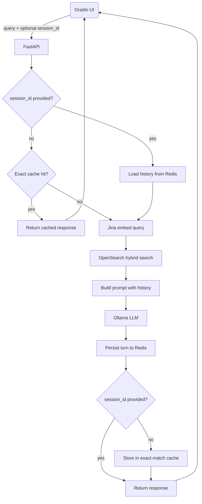
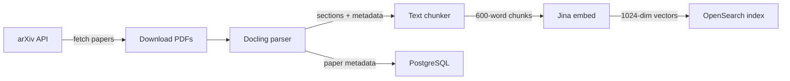

# arXiv RAG: Research Paper Q&A with Multi-Turn Dialogue

A RAG system that ingests arXiv CS papers daily and lets you have a conversation with them. All LLM inference runs locally, no OpenAI key required.

---

## What Problem Does This Solve

ML research publishes hundreds of papers a week in cs.AI and cs.LG alone. Skimming abstracts only gets you so far. What you actually want is to ask questions like *"how do the attention mechanisms in these papers differ?"* and get grounded answers while being able to follow up naturally without re-stating context.

Existing tools either send your data to a cloud API, require manual copy-pasting, or lose track of the conversation after one turn. This system:

- Automatically pulls new arXiv papers every weekday morning
- Parses full PDFs respecting document structure, not arbitrary character windows
- Runs hybrid keyword and vector search for better retrieval than either alone
- Answers questions using a local LLM with no API key and no per-token billing
- Remembers what you already asked within a session
- Caches repeated queries so the same question never hits the LLM twice

---

## How I Approached It

The core challenge is the gap between what users ask and what's in a paper. A keyword search for "hallucination reduction" misses papers that phrase it differently. A pure vector search misses exact terminology matches. The solution is hybrid search: BM25 and k-NN combined via Reciprocal Rank Fusion, which handles both cases without manual weight tuning.

PDF parsing was the next bottleneck. Splitting on character counts cuts across paragraphs and section boundaries, which hurts retrieval quality. I used Docling to extract section structure first, then chunk at section boundaries (600 words, 100-word overlap). Docling runs its layout and OCR models on GPU when available, which brings per-PDF parse time down to 7-35 seconds. Retrieved chunks are coherent on their own.

For multi-turn dialogue, I kept sessions opt-in. Stateless requests are cache-eligible and a session only starts when the client passes back a `session_id`. This keeps single questions fast and cache-friendly while allowing follow-ups when needed.

The ingestion pipeline runs as an Airflow DAG. It's overkill for five sequential tasks, but it gives retry logic, task isolation, and a UI to inspect past runs, which reflects how production pipelines are actually built.

### Request Flow



### Ingestion Pipeline



### Performance Numbers

| Metric | Value |
|---|---|
| Query embedding | ~370ms (Jina API round-trip) |
| Hybrid search | ~72ms (BM25 + k-NN via RRF) |
| Cached response | ~390ms (145x faster than full LLM call) |
| LLM generation (Llama 1B, Ollama on CPU) | ~51s |
| PDF parsing (Docling on GPU) | 7-35s per paper |
| Cache TTL | 6h exact-match, 24h session history |
| Chunk size | 600 words, 100-word overlap |
| Embedding dimensions | 1024 (jina-embeddings-v3) |

Retrieval and embedding takes under 500ms combined. The LLM is the bottleneck by a large margin. Docling already uses the GPU for parsing, but Ollama runs CPU-only inside Docker since the container has no GPU passthrough configured. Switching Ollama to a GPU runtime would bring generation from ~51s to under 2s.

---

## Stack

| Layer | Technology | Why |
|---|---|---|
| API | FastAPI | Async-native, automatic OpenAPI docs |
| LLM | Ollama (Llama 3.2) | Local inference, no API cost, swappable models |
| Embeddings | Jina AI (`jina-embeddings-v3`) | Search-specific task modes outperform general sentence transformers on retrieval |
| Search | OpenSearch (BM25 + k-NN + RRF) | One index for both keyword and vector search, no separate vector DB |
| PDF parsing | Docling (GPU-accelerated) | Extracts section structure instead of raw text, runs layout and OCR models on CUDA when available |
| Caching + sessions | Redis | TTL-native, handles both exact-match cache and session history in one service |
| Orchestration | Apache Airflow | Retry logic, task isolation, run history |
| Observability | Langfuse (self-hosted) | End-to-end traces: embed, search, prompt construction, generation |
| Database | PostgreSQL | Paper metadata and Airflow state |
| UI | Gradio | Fast to build, streaming SSE support |
| Packaging | Docker Compose + uv | Single `make start` brings up all 10 services |

---

## Demo

**Repo:** [github.com/aksh-ay06/RAG](https://github.com/aksh-ay06/RAG)

To run it locally:

```bash
git clone https://github.com/aksh-ay06/RAG.git
cd RAG
cp .env .env.local        # add your Jina API key (free tier)
make start                # pulls and starts all 10 services
docker exec rag-ollama ollama pull llama3.2:1b
uv run python gradio_launcher.py
```

Open http://localhost:7861 and start asking questions.

| Service | URL |
|---|---|
| Chat UI | http://localhost:7861 |
| API docs | http://localhost:8000/docs |
| Airflow | http://localhost:8080 |
| Langfuse traces | http://localhost:3000 |

The only external dependency is a free [Jina AI](https://jina.ai/) API key for embeddings.

---

## What I'd Improve Next

**Smarter retrieval**
The current pipeline embeds the raw query. Query expansion, where the system generates hypothetical answers or alternate phrasings before embedding, consistently improves recall on dense technical text. HyDE (Hypothetical Document Embeddings) would be the first thing I'd add.

**Reranking**
RRF blends BM25 and vector scores well, but a cross-encoder reranker applied to the top-20 candidates before sending to the LLM would improve the quality of the final top-5 noticeably. This matters most for long, multi-concept queries.

**Better chunking**
Section-based chunking is a big step up from character splits, but sections vary a lot in length. A late-chunking approach, where you embed the full section then split for storage, preserves more context in the vectors.

**Authentication and persistent sessions**
Refreshing the page loses the session right now. A simple auth layer would let users resume previous conversations and build up a personal history of questions across sessions.

**GPU support for Ollama**
Docling already picks up the GPU automatically on the host. Ollama is the remaining bottleneck since the Docker container has no GPU passthrough. Adding an `nvidia` runtime flag to the compose config would drop generation latency from ~51s to under 2s without changing anything else in the stack.

**Evaluation harness**
There's no automated way to measure retrieval quality or answer faithfulness right now. Adding a RAGAS-based eval against a small golden dataset would make it possible to compare chunking strategies, model swaps, or prompt changes with actual numbers.
