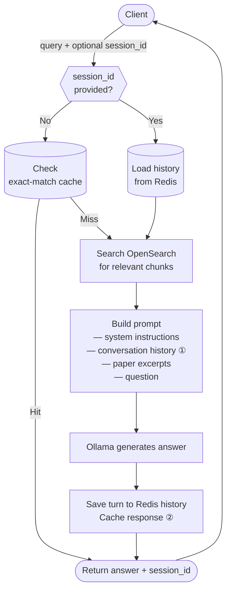

# Multi-Turn Dialogue Architecture

## How a request flows through the system

> ① History is only injected when a `session_id` was provided and prior turns exist.
> ② Response is only written to the exact-match cache for stateless (no `session_id`) requests.

---

## What changes between stateless and session requests

| | No `session_id` | With `session_id` |
|---|:---:|:---:|
| Load conversation history | — | ✓ |
| Check exact-match cache | ✓ | — |
| History injected into prompt | — | ✓ |
| Save turn to history | ✓ | ✓ |
| Write to exact-match cache | ✓ | — |
| `session_id` in response | new UUID | echoed back |

---

## Redis storage

| Key | Contains | Expires |
|---|---|---|
| `exact_cache:{hash}` | Cached response JSON | 6 h |
| `session:{id}:history` | Last 10 messages (5 turns) | 24 h, resets each turn |
