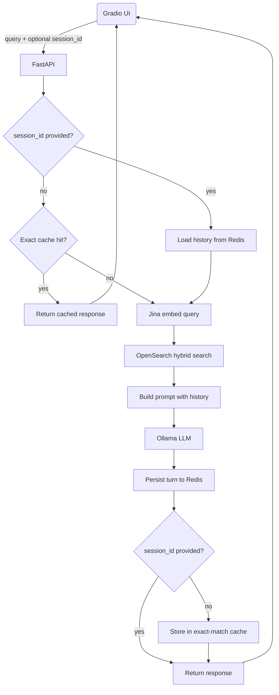

# Session Architecture

## Request Flow

## Stateless vs Session

| | No `session_id` | With `session_id` |
|---|:---:|:---:|
| Load history | — | ✓ |
| Check cache | ✓ | — |
| History in prompt | — | ✓ |
| Save turn | ✓ | ✓ |
| Store in cache | ✓ | — |
| `session_id` in response | new UUID | echoed |

## Redis Keys

| Key | TTL | Notes |
|---|---|---|
| `exact_cache:{sha256[:16]}` | 6 h | Keyed on query + model + top_k + use_hybrid + categories |
| `session:{id}:history` | 24 h | Resets on each turn. Stores last 5 turns (10 messages) |
