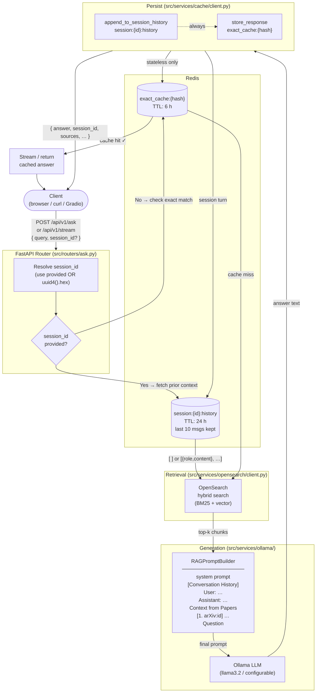
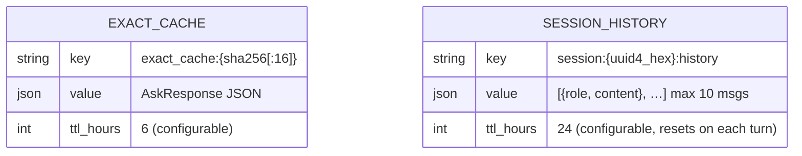
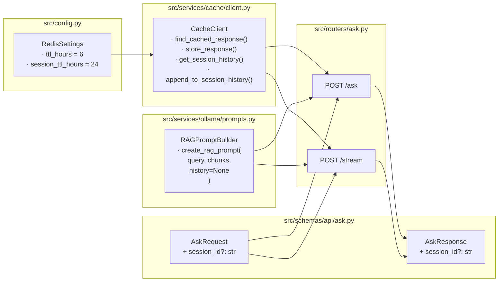

# Multi-Turn Dialogue Architecture

## Request Flow

## Redis Key Spaces

## Session vs Stateless Decision Matrix

| | **No `session_id`** | **With `session_id`** |
|---|---|---|
| Fetch history | ✗ | ✓ `get_session_history(id)` |
| Check exact-match cache | ✓ | ✗ |
| Inject history into prompt | ✗ | ✓ (if history non-empty) |
| Append turn to history | ✓ | ✓ |
| Store in exact-match cache | ✓ | ✗ |
| `session_id` in response | ✓ (new) | ✓ (echoed) |

## Component Map

